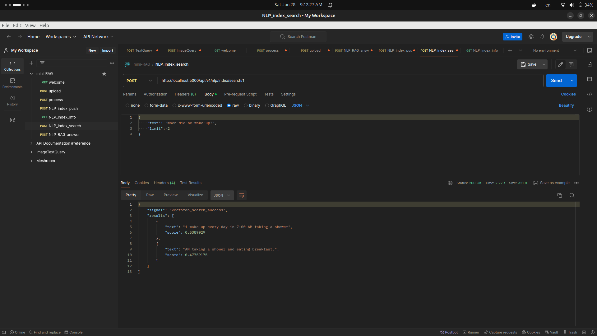

# Table of Contents

1. [Overview](#overview)
2. [What is Retrieval-Augmented Generation (RAG)?](#what-is-retrieval-augmented-generation-rag)
3. [Project Structure](#project-structure)
4. [Features](#features)
5. [Requirements](#requirements)
6. [Installation](#installation)
7. [API Overview](#api-overview)
8. [Usage Guide](#usage-guide)
    - [Uploading Documents](#uploading-documents)
    - [Splitting Documents](#splitting-documents)
    - [Indexing Documents](#indexing-documents)
    - [Retrieving Index Information](#retrieving-index-information)
    - [Searching & Retrieval](#searching--retrieval)
    - [Answer Generation](#answer-generation)
9. [Customization](#customization)
10. [License](#license)
11. [Contact](#contact)


# RAG-Assistant – Project Documentation

## Overview

**RAG-Assistant** is a minimal and extensible Retrieval-Augmented Generation (RAG) system for intelligent question answering. It combines vector database retrieval with large language models (LLMs) to generate answers based on your own document collections.


# What is Retrieval-Augmented Generation (RAG)?

Retrieval-Augmented Generation (RAG) is a modern artificial intelligence (AI) paradigm that enhances the capabilities of large language models (LLMs) by integrating information retrieval mechanisms. This approach combines the strengths of two AI fields:
- **Information Retrieval** (search engines, vector databases, etc.)
- **Natural Language Generation** (LLMs such as GPT, Gemini, Cohere, etc.)

The result is a system that can generate more accurate, up-to-date, and contextually relevant answers, even about topics outside of the LLM’s static training data.


## Why Use RAG?

Traditional LLMs are limited to the data they were trained on and cannot access new or private information. RAG overcomes this by:
- **Accessing private, custom, or updated knowledge bases** (e.g., your company documents, research papers, or recent news).
- **Improving factual accuracy** by grounding responses in retrievable evidence.
- **Supporting explainability** by showing retrieved sources alongside answers.


## How Does RAG Work?

RAG architecture typically consists of two main components:

### 1. Retriever

The retriever’s job is to find relevant pieces of information (“chunks”) from a large collection of documents or knowledge base. This is often done using a **vector database** (like Qdrant, Pinecone, Weaviate, etc.), which enables efficient similarity search based on embeddings.

**Steps:**
- The user submits a query.
- The retriever encodes the query into a vector and retrieves the most relevant document chunks from the database.

### 2. Generator

The generator (an LLM) takes both the user’s original query and the retrieved context, then generates a coherent, context-aware response.

**Steps:**
- The LLM receives the user query and the retrieved chunks as context.
- It synthesizes an answer, often referencing or quoting the retrieved sources.


## RAG Architecture Diagram

Below is a high-level workflow of a RAG system:

```
User Query
    │
    ▼
Retriever (Vector DB Search)
    │
    ▼
Relevant Chunks (Context)
    │
    ▼
Generator (LLM)
    │
    ▼
Generated Answer
```


## Example Workflow

1. **User asks:** “What are the main benefits of RAG systems?”
2. **Retriever** searches a document collection for relevant passages.
3. **Generator** (LLM) receives both the question and retrieved passages, then generates a synthesized answer:
   > “RAG systems improve factual accuracy, enable up-to-date knowledge integration, and provide explainable, source-grounded responses.”


## Key Benefits

- **Accuracy:** Answers are grounded in real sources, reducing hallucinations.
- **Freshness:** Can access new or updated content unavailable during LLM training.
- **Customization:** Easily adapt to company documents, personal notes, or domain-specific knowledge.
- **Explainability:** Can show which sources were used to form the answer.


## Real-World Applications

- **Enterprise search assistants** (internal knowledge bases, support bots)
- **Scientific and legal research tools**
- **Customer service chatbots**
- **Educational tutors using up-to-date content**


## RAG in the RAG-Assistant Project

In this repository, RAG-Assistant provides:
- Document upload and chunking
- Efficient indexing and retrieval (via Qdrant)
- LLM-based answer generation using retrieved context
- API endpoints for every stage, enabling easy integration and extension


*Retrieval-Augmented Generation (RAG) is transforming the way AI systems interact with knowledge, making them more reliable, adaptable, and useful for real-world tasks.*


## Project Structure

The project follows a modular structure, separating concerns for scalability and maintainability.

```
RAG-Assistant/
│
├── docker/                       # Docker configuration files
├── images/                       # Images for documentation and UI
├── src/
│   ├── assets/                   # Uploaded files and assets
│   ├── controllers/              # Business logic and feature controllers
│   ├── helpers/                  # Utility functions and configuration
│   ├── models/                   # Data models (MongoDB, vector DB, etc.)
│   ├── routes/                   # FastAPI routes (API endpoints)
│   └── stores/
│       └── llm/                  # LLM-related code (providers, templates)
|       └── vectordb/             # VectorDB code (QdrantDB)
│
├── .env.example                  # Example environment configuration
├── requirements.txt              # Python dependencies
├── README.md                     # Project readme
└── main.py                       # FastAPI app entrypoint
```


## Features

- **Retrieval-Augmented Generation (RAG):** Integrates vector-based retrieval with generative LLMs for precise, context-rich answers.
- **FastAPI Backend:** RESTful API for document upload, indexing, search, and question answering.
- **Multi-language Support:** English & Arabic prompt templates for multilingual queries and responses.
- **Flexible Vector Database Integration:** Easily index/search custom documents using embeddings and vector similarity search (Qdrant by default).
- **Pluggable LLM Providers:** Supports OpenAI, Cohere, and Gemini out of the box.
- **Dockerized Deployment:** Docker Compose configuration for local and cloud environments.
- **Environment-based Configuration:** `.env` files centralize and secure API keys and settings.


## Requirements

- Python 3.10 or higher
- Docker (optional, for containerized deployment)
- API key for your LLM provider (e.g., OpenAI, Cohere, Gemini)


## Installation

1. **Install Python Dependencies**

    ```bash
    pip install -r requirements.txt
    ```

2. **Configure Environment Variables**

    ```bash
    cp .env.example .env
    # Edit .env to provide your LLM/API keys and database settings
    ```

3. **Launch with Docker Compose (if MongoDB is not already available)**

    ```bash
    cd docker
    cp .env.example .env
    # Edit docker/.env for your environment
    sudo docker compose up -d
    ```

4. **Start the FastAPI Server**

    ```bash
    uvicorn main:app --reload --host 0.0.0.0 --port 5000
    ```


## API Overview

- `GET /api/v1/`: Base API endpoint.
- `POST /api/v1/data/upload/{project_id}`: Upload documents with a unique name within a project.
- `POST /api/v1/data/process/{project_id}`: Split uploaded documents into smaller chunks.
- `POST /api/v1/nlp/index/push/{project_id}`: Index documents for a specific project.
- `GET /api/v1/nlp/index/info/{project_id}`: Retrieve information about the indexed collection.
- `POST /api/v1/nlp/index/search/{project_id}`: Search for relevant chunks in the vector database.
- `POST /api/v1/nlp/index/answer/{project_id}`: Obtain an answer to a question using the RAG pipeline.


## Usage Guide

### Uploading Documents

Use `/api/v1/data/upload/{project_id}` to upload your documents (PDF or text). All files are organized by project for easy management.


### Splitting Documents

Use `/api/v1/data/process/{project_id}` to split documents into manageable chunks for indexing and retrieval.

**Parameters:**
- `file_id`: (optional) Process a specific document, or all documents in the project
- `chunk_size`: Number of characters per chunk
- `overlap_size`: Number of overlapping characters between chunks
- `do_reset`: Remove all existing chunks for this project in MongoDB


### Indexing Documents

Index your processed chunks into the vector database using `/api/v1/nlp/index/push/{project_id}`.

**Parameters:**
- `do_reset`: (optional) Remove all current data from QdrantDB


### Retrieving Index Information

Use `/api/v1/nlp/index/info/{project_id}` to view all indexed chunks for a project.


### Searching & Retrieval

Search for the most relevant document chunks with `/api/v1/nlp/index/search/{project_id}`.

**Parameters:**
- `text`: User query
- `limit`: Number of related chunks to return




### Answer Generation

Get context-aware answers from the LLM with `/api/v1/nlp/index/answer/{project_id}`.

**Parameters:**
- `text`: User query
- `limit`: Number of relevant chunks to provide to the LLM


## Customization

- **Prompt Templates:** Located in `src/stores/llm/template/locales/` for English & Arabic.
- **LLM Providers:** Extend or switch providers (Gemini, OpenAI, Cohere) in `src/stores/llm/providers/`.
- **Vector Database:** Swap or extend the vector DB backend as needed.


## License

[Apache License 2.0](LICENSE)


## Contact

- [LinkedIn](https://www.linkedin.com/in/ahmed-ayman-25a9b2248/)
- [Gmail](mailto:ai388981@gmail.com)